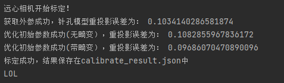

# Telecentric-Calibration 
***
A Python-based telecentric camera calibrator, including a high-precision corner detector, suitable for chessboard 
and Halcon calibration boards.

（In continuous updating：2025.1.7）

基于Python的远心相机标定器，包括一个高精度的角点检测器，适用于棋盘格与Halcon标定板。

（正在更新中：2025.1.7）

***
The code principles will be further explained on the wiki.

代码原理后续在 [wiki](https://github.com/hzweifei/Telecentric-Calibration/wiki) 中说明。

# Screenshots

# Calibration board

这里推荐一个可生成标定板pdf的网站，可用于打印。包括棋盘格，圆等形式的标定板。

Here is a website where you can generate calibration target PDFs for printing, including chessboard grids, circles, and other shapes:

[Click here](https://calib.io/pages/camera-calibration-pattern-generator)

# Support :satisfied:

我是个初学者，我很乐意接受其他人的建议，包括指出代码的原理性错误和wiki原理说明中存在的问题等，以改进或简化代码，提高效率。

如果您想发表任何评论或建议，也可以发电子邮件：2710175658@qq.com

:sunglasses: :sunglasses:

I am a beginner, and I am willing to accept suggestions from others, including pointing out fundamental errors in the code and issues in the explanatory wiki pages, to improve or simplify the code and enhance efficiency.

If you would like to make any comments or suggestions, you can also email: 2710175658@qq.com